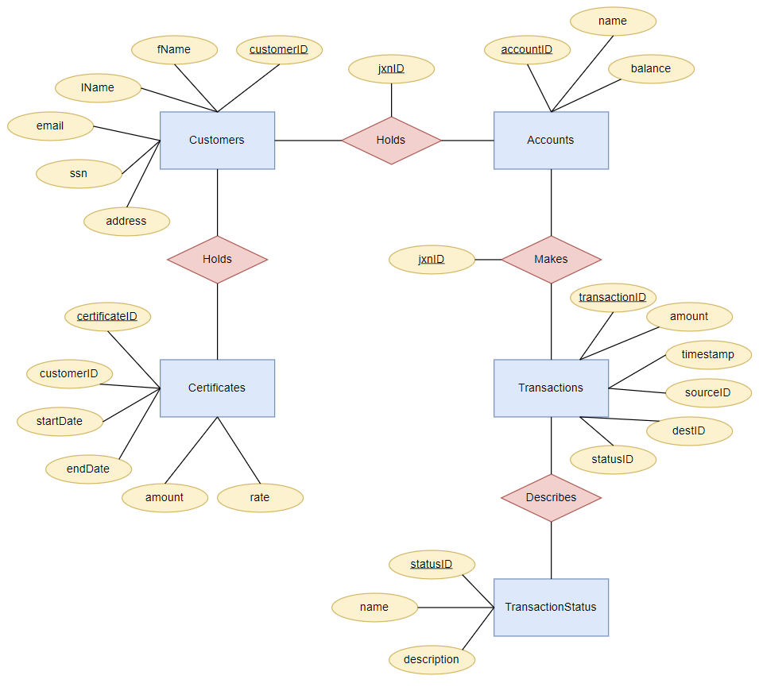
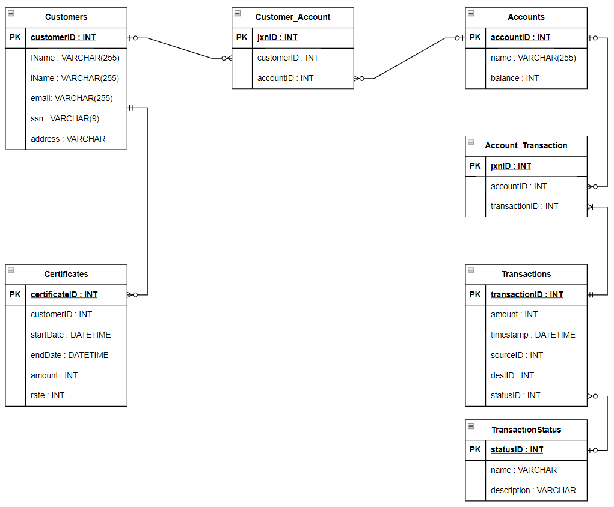

# **Banking Database Project**
### ***Version: 1.1.0***

 

This repository holds the working "Banking Database Project", originally created as a term project for Oregon State University's Introduction to Databases course (CS 340). This respository is in-progress and will feature a full banking database application built using React.

 

## **Database Design**

 

***Entity Relationship Diagram***

 

***Schema***

 

## **Installation Instructions**

To use this project, run **`npm install`** in the root directory.

Running the React app locally can be done via **`npm start`** in the root directory.

When running locally, navigate to: `http://localhost:3000/`.

 

## **SQL Database Instructions**

To run this app, a database must be linked for create, read, update, and delete (CRUD) operations. For developing the database app, we used MariaDB and phpMyAdmin (no longer accessible, new solution necessary). Your database should be linked through the **`dbConfig.json`** file in the root directory. If the format of this file does not work for your database, or if you wish to change the name of the file, you are free to do so, but be careful to fix any references to this file in any file where the database is accessed.
